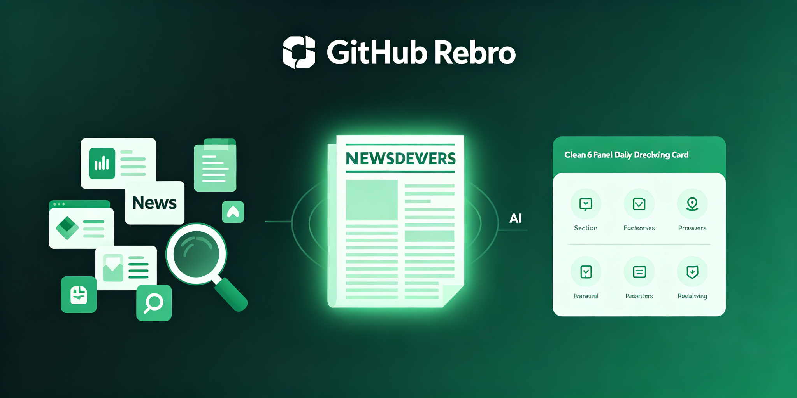

<div align="center">




# ev-news-briefing

**新能源行业每日早报：Tavily 多角度搜 → 时效过滤 → AI 生成 → 飞书推送。**

<p>
  <a href="#"></a>
  <a href="#"></a>
</p>

[流水线](#流水线) · [六板块](#六板块)

</div>

---

## 流水线

```
Tavily 多角度搜索 → 代码层时效过滤 → 域名信任加分 → AI 生成 → 飞书推送
```

## 六板块

| 板块 | 内容 |
|------|------|
| 🚨 风险 | 政策/事故/召回 |
| ⚖️ 政策 | 补贴/法规/标准 |
| 🔗 供应链 | 电池/芯片/原材料 |
| ⚔️ 友商 | 新车型/价格战 |
| 🚀 技术 | 智驾/电池/新平台 |
| 📈 资本 | 融资/上市/财报 |

## License

MIT
